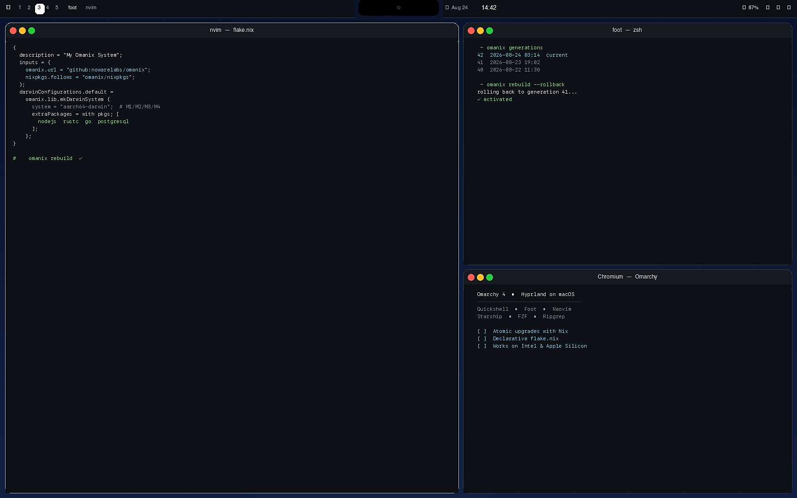

# Omanix

> **A fast, reproducible desktop for Mac, powered by Nix.**

Omanix gives you a curated macOS desktop that is declarative, versioned, and instantly reversible — no Linux partition, no manual package hunting, no `~/.config` drift.

<p align="center">
  
</p>

<p align="center">
  <a href="https://nixos.org"></a>
  <a href="https://github.com/nowarelabs/omanix"></a>
  <a href="https://github.com/nowarelabs/omanix"></a>
  <a href="./LICENSE"></a>
</p>

<p align="center">
  <a href="#install">Install</a> · <a href="#quick-start">Quick Start</a> · <a href="#features">Features</a> · <a href="#store">Store</a> · <a href="./docs/principles.md">Principles</a>
</p>

---

## What is Omanix?

Omanix is a **distro for your Mac**. One `flake.nix` describes your whole machine — apps, bar, theme, widgets, and system settings. Change one line, `omanix rebuild`, and you get the same desktop on any Mac. Break something? `omanix rebuild --rollback` undoes it in seconds.

It runs natively on macOS (Apple Silicon and Intel, macOS 12+), installs with one command, and leaves your Mac pristine if you remove it.

**For green users:** you get an App Store-like GUI. No terminal required.
**For Nix users:** you get a clean, typed flake you can read in 30 lines and scale to many machines and, later, Linux.

> New to flakes? See [Quick Start](#quick-start). Curious why it is built this way? See [Principles](./docs/principles.md).

---

## Install

**No prerequisites. Nix is installed for you.**

```bash
curl -fsSL https://raw.githubusercontent.com/nowarelabs/omanix/main/bin/install | sh -s -- install
```

5–15 minutes, then reboot into Omanix. The installer checks for Nix (installs it if missing), clones the Omanix flake to `~/.omanix`, prompts for your Mac username and hostname, and builds your desktop.

*Already have Nix? The installer skips it. To update: `curl -fsSL https://raw.githubusercontent.com/nowarelabs/omanix/main/bin/install | sh -s -- update`*

---

## Quick Start

**1. Open the Store** — `Super` (⌘) → **Omanix Store** or `open -a "Omanix Store"`. No command line needed.

**2. Install an app** — search `Slack`, click **Install**. The Store edits your flake, rebuilds, and shows a diff preview. Or in terminal:
```bash
omanix add ripgrep        # from nixpkgs
omanix add google-chrome  # signed .app from Homebrew, declaratively
omanix search ripgrep
```

**3. Try a widget** — in the Store toggle **Pomodoro** on, or:
```bash
omanix add pomodoro       # adds a timer widget + optional menubar app
```
Remove it the same way: toggle off or `omanix remove pomodoro` → rebuild. `omanix rebuild --rollback` undoes anything.

**Next:** pick a theme (`omanix.theme = "tokyo-night"` in `configuration.nix` or in the Store), then `omanix rebuild`.

---

## Features

- **One command, any Mac** — Apple Silicon (M1/M2/M3/M4) or Intel, macOS 12+. Same `flake.lock` on your Mac and your teammate's.
- **One file, one lock** — `~/.omanix/configuration.nix` (`omanix.host`, `omanix.user`, `omanix.theme`, `omanix.widgets.*`) is your machine. `flake.lock` pins every package.
- **Store GUI, enabled by default** — Browse `nixpkgs` + Homebrew, toggle widgets and themes, tweak system settings with sliders. The Store is itself a widget you can disable.
- **Widgets as apps** — Clock, workspaces, battery and community widgets like pomodoro are `launchd`/`Swift` derivations (`omanix.widgets.pomodoro.enable` via `lib/mkWidget`/`lib/mkApp`, SDK + auto-wrap). They appear as Mac apps and vanish on removal.
- **AI, local and frontier** — `omanix ask --local "make it darker"` runs Qwen 3–7B offline via Ollama (no API key, <2s, `skills/omanix/mini-SKILL.md`). *“Make a pomodoro app”* via Claude/OpenCode uses the full skill, builds a Swift app in `overlays/`, previews instantly (`omanix rebuild --preview` → hot-reload), then commits to your flake.
- **Pristine by design** — Everything is in `/nix/store` and `homebrew` with cleanup. `omanix uninstall` removes Nix, widgets, Swift apps, and the casks it added. Your Mac is as you found it.

---

## Store — for users who don't live in the terminal

The Store (`Super → Omanix Store`, `omanix store`) is a SwiftUI app (future Linux: GTK) built as `omanix.widgets.store`:

- **Browse** packages, widgets, and themes — descriptions from `search.nixos.org` and `brew info`, live previews.
- **Install / Remove** with one click — the Store calls the same `omanix add` helpers the CLI does, shows a diff, runs `nix flake check` dry, then rebuilds. Failed? **Rollback** button.
- **Configure** — toggles for `omanix.widgets.*`, theme picker, system settings (dock, trackpad, Touch ID). No `.nix` syntax required day one; power users can still `cat configuration.nix` and see the exact change.

---

## Use

### Keep your system current

```bash
omanix rebuild              # rebuild after editing configuration.nix
omanix rebuild --rollback   # undo the last build, no data loss
omanix generations          # list previous systems
omanix update               # nix flake update + rebuild
```

### Your config — simple for green users, scales for many machines

```nix
# ~/.omanix/configuration.nix — the file you edit
{ pkgs, ... }: {
  omanix.host = "my-mac";
  omanix.user = "yourname";
  omanix.theme = "tokyo-night";
  omanix.widgets.pomodoro.enable = true;
  omanix.widgets.clock.enable = true;
  environment.systemPackages = with pkgs; [ nodejs ripgrep ];
  homebrew.casks = [ "google-chrome" ];
}
```

Need a second Mac? `cp -r hosts/my-mac hosts/work-mac`, change `host`, `omanix rebuild`. Future Linux? Same `omanix.theme`/`omanix.widgets` — `lib/mkSystem` picks the right desktop.

### AI — tell it what you want

```bash
omanix ask --local "make it darker"          # Qwen offline: sets omanix.theme
omanix ask "make me a pomodoro timer"        # Claude: writes widget to overlays/, previews instantly
omanix rebuild --preview                     # see the AI's draft without a new generation
# keep it? Store → Keep or: omanix add pomodoro --from-overlay overlays/pomodoro
```

`skills/omanix/SKILL.md` (frontier) and `mini-SKILL.md` (Qwen) + `statix`/`nixfmt` lint are auto-installed. Agents never write to `/nix/store`.

---

## Uninstall — leaves no trace

```bash
/nix/nix-installer uninstall
rm -rf ~/.omanix
sudo rm /Library/LaunchDaemons/org.nixos.* 2>/dev/null || true
# Homebrew casks added by Omanix are removed automatically (onActivation.cleanup = "uninstall")
sudo reboot
```

No `~/Library/LaunchAgents` plist, no `/Applications/Omanix` symlink, no `~/.omanix` residue — all were `/nix/store` symlinks or `homebrew` entries. Verified by `tests/pristine`.

---

## What's included

| Category | What you get |
|---|---|
| **Core** | Nix (Determinate) + `nix-darwin` + `home-manager`, versioned via `flake.lock` |
| **Desktop** | Tiling + bar that flows around the notch, `loginwindow` + Touch ID, `launchd` services |
| **Widgets / Apps** | Clock, workspaces, battery, network, audio + community widgets/apps (pomodoro etc. via `omanix.widgets.*`, Swift apps) |
| **Apps** | Chromium, Firefox, MPV and anything from `nixpkgs` or Homebrew via `omanix add` |
| **Dev** | Neovim + LSPs, Git, Docker, Node.js / Ruby / Python (add more with `omanix add`) |
| **Shell** | Zsh or Bash, Starship, FZF, Ripgrep, Tmux, Zoxide |

Full list is in `flake.nix`.

---

## Troubleshooting

<details><summary><code>Command not found: omanix</code></summary>

```bash
exec $SHELL
which nix; nix --version
# if missing, install Nix first:
curl --proto '=https' --tlsv1.2 -sSf -L https://install.determinate.systems/nix | sh -s -- install --determinate
# then reinstall Omanix:
curl -fsSL https://raw.githubusercontent.com/nowarelabs/omanix/main/bin/install | sh -s -- install
```
</details>

<details><summary><code>Permission denied</code> during rebuild</summary>

```bash
sudo dseditgroup -o edit -a $(whoami) -t user wheel
# log out and back in
```
</details>

<details><summary>Rollback a bad update</summary>

```bash
omanix rebuild --rollback
```
</details>

<details><summary>Disk full</summary>

```bash
nix-collect-garbage -d
```
</details>

---

## Contributing & Support

- **Bugs / ideas:** [GitHub Issues](https://github.com/nowarelabs/omanix/issues) · [Discussions](https://github.com/nowarelabs/omanix/discussions)
- **Hack locally:**
  ```bash
  git clone https://github.com/nowarelabs/omanix.git ~/.omanix
  cd ~/.omanix && nix develop
  omanix rebuild
  ```

  This overwrites the installed version with your dev copy. To restore: run the install command again.
- **Docs for builders:** [Principles](./docs/principles.md) (invariants), [Philosophies](./docs/philosophies.md) (why), [Conventions](./docs/conventions.md) (how + folder structure). The README is for *users*; docs are for *builders*.

## License

ISC — see [LICENSE](./LICENSE).

## Acknowledgements

Built on [nix-darwin](https://github.com/LnL7/nix-darwin), [home-manager](https://github.com/nix-community/home-manager), [Determinate Nix](https://determinate.systems), and the open-source community. Inspired by modern desktop design. See `CHANGELOG.md` for history.

<p align="center"><sub>See <a href="./CHANGELOG.md">CHANGELOG.md</a> for release notes.</sub></p>
